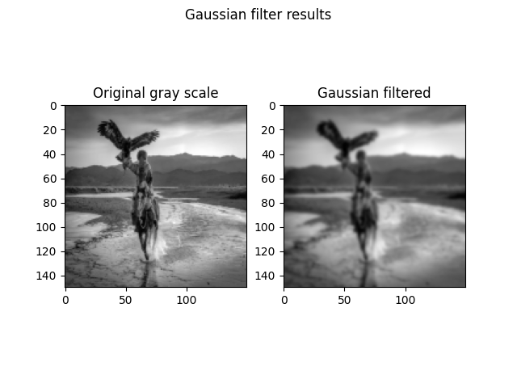
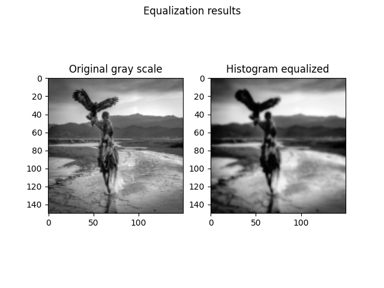
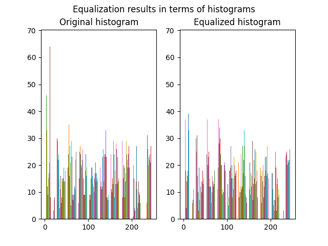

# Histogram Equalization
## What is that for?
Histogram is image processing technique to represent intensity values of an image. Equalization technique is utilized for spreading higher local contrasts in the image.
Thiss allows us to increase the global contrast of the image while pixels with the highest intensity values are decreased locally, after application.
## How do we apply?
Histogram equalization cannot be applied to the RGB image, since it can make strong modifications on image channels. So that we transform the image into gray-scale form, initially. At the next step we apply Gaussian filter to image, which reduces noise in the image and blures regions of the image. Following figure depicts the difference after applying Gaussian Filter to the image.

Then we compute Histogram of the image, where x-axis shows pixel information, and y-axis represents intensity values of corresponding pixels. After getting the Histogram of the image, we compute cumulative distribution of the image (CDF) according to the intensity values of the pixels. We use maximum CDF value in the CDF array of the image and maximum intensity value of pixels to normalize CDF array of the image. At the next step we utilize maximum and minimum values of normalized CDF in order to equalize the histogram of the image. At the end we also apply Gaussian filter as a low-pass filter to blur regions of the image. Following figure depicts the original gray-scaled image and an image to which histogram equalization was applied.

On the other hand, the following figure expresses the difference between original and equalized histogram data

We know that 0 and 255 correspond to black and white in gray-scale, respectively. It's seen that while intensity of black-ish pixels were high before application, this intensity was spread to the other pixels after application.

## What did we change?
In [old_data](old_data) you can find the previous version of the source code. The new version of the source code satisfies Python PEP-8 standards and cleaner than before, so that all required information is also provided. Additionally, the previous version was useful for single image, while the new version is applicable for n images in [dataset](dataset) directory. When process will be done for all images in the folder, ([statistics.py](src/statistics.py)) object will choose one image randomly and provide corresponding images above. The folder with the name of the chosen image will be created and results will be saved within (e.g., [examples_dir/eagleHorse.jpg](examples_dir/eagleHorse.jpg)).

